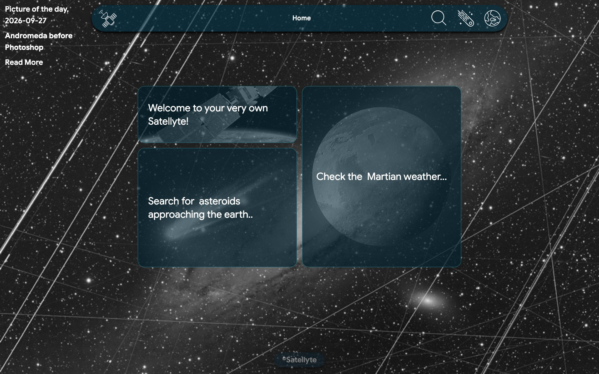
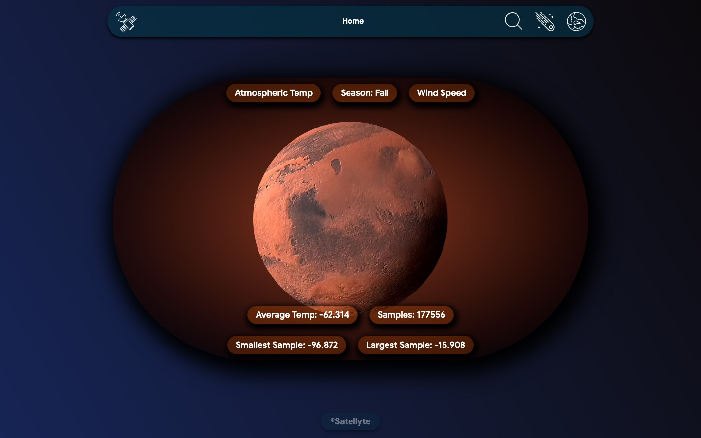
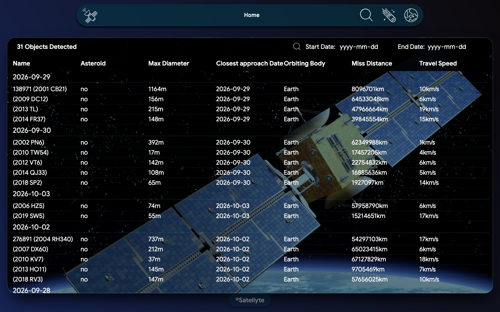
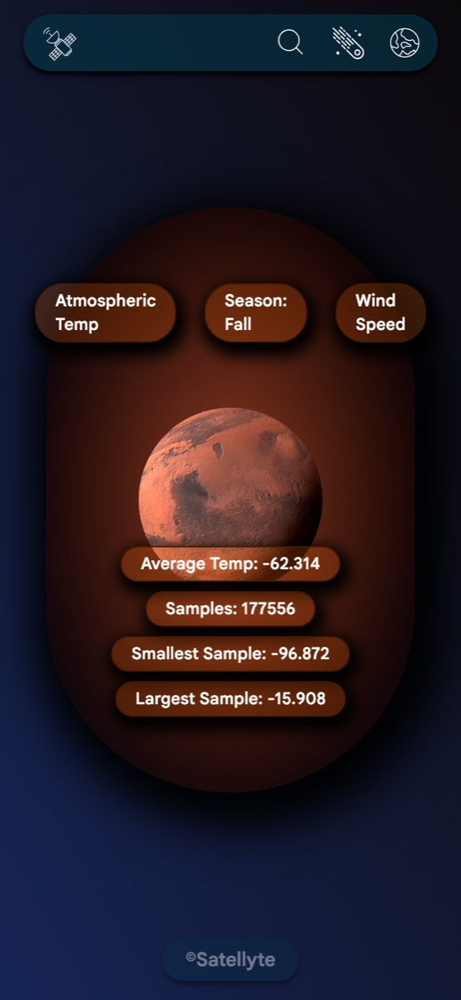

# Satellyte

A space explorer built on NASA's open APIs. See the astronomy picture of the day, search
NASA's image library, check the weather on Mars and track asteroids passing close to Earth.

**Live demo:** [satellyte.vercel.app](https://satellyte.vercel.app)



## Features

- **Picture of the day** as the home page background, with its title and description
- **Image search** across NASA's media library, with a full-size view for each result
- **Mars weather** from the InSight lander: temperature, wind speed and season
- **Asteroid tracker** listing near-Earth objects for any date range up to 7 days, with size,
  miss distance and speed
- Responsive layout from mobile to desktop

| Mars weather | Asteroid tracker |
|---|---|
|  |  |



## Tech stack

- React 19 with Vite
- React Router for pages and nested routes
- Tailwind CSS
- A custom `useApi` hook for fetching, loading and error states
- NASA APIs: APOD, NeoWs, InSight and the NASA Image and Video Library

## What I learned

- Working with several different APIs, each with its own response shape and error format
- Writing a reusable fetch hook instead of repeating the same logic on every page
- Nested routes with `<Outlet />` for the Mars sub-pages
- Keeping API keys out of the repository with environment variables

## Running locally

1. Get a free API key at [api.nasa.gov](https://api.nasa.gov)
2. Copy `.env.example` to `.env` and add your key
3. Install and start:

```bash
npm install
npm run dev
```

The InSight mission ended in 2022, so the Mars page shows the last data the lander sent back.
